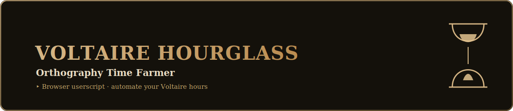

  

  
  
  

# Description

Voltaire Hourglass est un script JavaScript permettant d'augmenter le temps d'utilisation d'un compte Voltaire. Le script est conçu pour les utilisateurs qui souhaitent maximiser leur temps d'utilisation sur la plateforme.

Le script fonctionne en utilisant des techniques d'automatisation pour simuler l'interaction de l'utilisateur avec les différents niveaux de la plateforme Voltaire. Les scripts sont disponibles en fonction du type de niveau que l'utilisateur souhaite compléter.

# Utilisation

Pour utiliser Voltaire Hourglass, il est nécessaire de suivre les étapes suivantes :

1. Télécharger ou cloner le projet à partir de Github.
2. Ouvrir le navigateur Web et se connecter à la plateforme Voltaire.
3. Sélectionner le niveau que l'on souhaite compléter.
4. Ouvrir la console du navigateur en appuyant sur la touche F12.
5. Insérer le script dans la console du navigateur.
6. Laisser le script tourner en arrière-plan.

# Technologies utilisées

